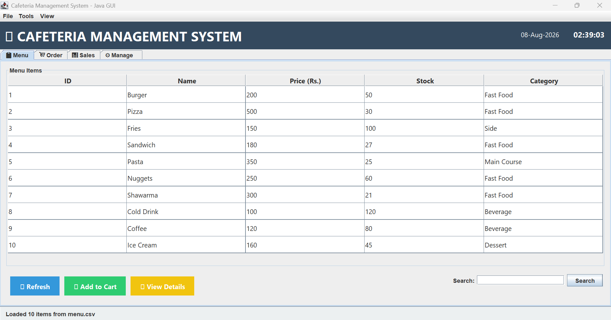
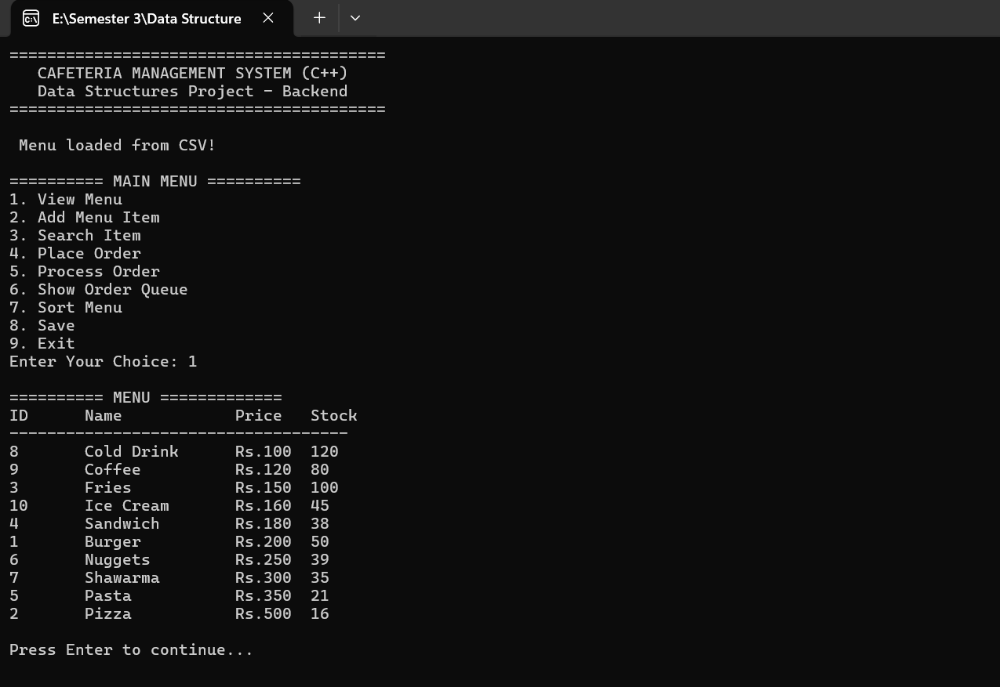

<div align="center">

# 🍽️ CaféSync Pro 
### *Dual-Stack Cafeteria Management System (C++ / Java)*


[**▶️ Live Demo**](https://youtu.be/0RAKQBiwlcE) | [**📄 Documentation**](./Project%20Report.pdf)

</div>

---

## 📖 Abstract

CaféSync Pro is a robust, dual-technology Desktop Application designed to solve real-world cafeteria management challenges through the lens of advanced Computer Science principles. The system bridges the gap between high-performance algorithmic processing and modern, user-friendly interface design. 

The project demonstrates **cross-language interoperability** by utilizing **C++** to handle core back-end data structures (Arrays, Linked Lists, Queues) and sorting algorithms, while leveraging **Java Swing** for a comprehensive and responsive graphical user interface. These two distinct ecosystems communicate seamlessly through standardized CSV (Comma-Separated Values) file contracts, simulating a true microservices architecture in a desktop environment.

---

## 🚀 Project Concept & Motivation

The core challenge this project addresses is: *"How can we combine the raw computational power of C++ with the visual accessibility of Java without complex networking protocols?"* 

The solution lies in **Shared Data Contracts**. By having both the C++ and Java modules read from and write to the same set of `.csv` files (`menu.csv`, `orders.csv`, `sales.csv`), the system creates a decoupled architecture where:
- The **C++ Backend** acts as the rigorous computational engine, ensuring data integrity and processing order queues.
- The **Java Frontend** acts as the visual interaction layer, allowing staff to manage inventory, place orders, and view analytics in real-time.

This architecture mimics the separation of concerns found in enterprise-grade software, making it an excellent study in modular software design.

---

## 📸 System Showcase

Below are the live screenshots of the dual-stack system in action, along with a full video walkthrough.

<p align="center">
  
  <br>
  <em>Figure 1: Java Swing GUI (Frontend) - Interactive Menu, Cart, and Sales Dashboard</em>
</p>

<br>

<p align="center">
  
  <br>
  <em>Figure 2: C++ Console (Backend) - Data Structures, Queue Management, and Sorting</em>
</p>

<br>

<p align="center">
  <a href="https://youtu.be/0RAKQBiwlcE" target="_blank">
    
  </a>
  <br>
  <em>Click the button above to watch the complete system walkthrough</em>
</p>

---

## 📁 Technical Architecture & Data Flow

### System Interaction Diagram
The following diagram illustrates the bi-directional data flow between the C++ backend, the Java frontend, and the shared CSV storage.

```text
┌─────────────────┐      Reads/Writes      ┌──────────────────────┐
│  Java Swing GUI  │  ──────────────────►  │  Shared CSV Files    │
└─────────────────┘                        └──────────┬───────────┘
                                                       │ Reads/Writes
                                                       ▼
┌─────────────────┐      Enqueues/Process  ┌──────────────────────┐
│  C++ Backend    │  ◄──────────────────   │  Order Queue (FIFO)  │
└─────────────────┘                        └──────────────────────┘

How the Data Pipeline Works:

1. User Input: The staff member uses the Java GUI to select items and place an order.

2. CSV Update: The Java application appends the order details to orders.csv and automatically deducts

the stock from menu.csv.

3. Backend Processing: The C++ application acts as the order processor. It reads orders.csv, places

the orders into a FIFO (First-In-First-Out) Queue.

4. Completion: The C++ engine processes the queue, marks the order as completed, and logs the final

sale into  sales.csv for reporting.


```
---

## 🎯 Core Capabilities & Technical Deep-Dive

### 🔹 Backend Engine (C++)

The C++ backend is designed to demonstrate fundamental Data Structures and Algorithms (DSA) using manual memory management.

- Static Array & Dynamic Linked List: The menu is initially stored in a fixed-size array (struct MenuItem). To demonstrate dynamic memory allocation, the system transfers these items into a Singly Linked List (struct Node), allowing for efficient traversal and potential future expansion without memory fragmentation.

- FIFO Queue Implementation: Orders are handled using a pure Queue structure (OrderNode). When an order is placed, it is enqueued at the rear. The system processes orders by dequeuing from the front, guaranteeing that orders are fulfilled in the exact order they were received.

- Algorithmic Sorting: The system includes a fully implemented Bubble Sort algorithm. This allows administrators to sort the menu items dynamically by price (lowest to highest) to assist customers in finding budget-friendly options.

- Linear Search: A standard Linear Search algorithm allows users to quickly locate menu items by their unique ID, bypassing the need to scroll through the entire list.

- CSV File I/O: The C++ engine includes robust file parsers that read menu.csv to update internal structures and write processed orders to sales.csv.

### 🔹 User Interface (Java Swing)

The Java Frontend is built using the standard Swing library, providing a desktop application with responsive components.

- Intelligent Cart System: Utilizes a DefaultListModel to store current order items. The cart performs real-time arithmetic, updating the total price instantaneously as items are added, removed, or quantities are adjusted.

- Live Sales Dashboard: The application features a dedicated "Sales" tab that reads sales.csv using Java BufferedReader. It automatically calculates and displays Daily Revenue, Total Orders, and Average Order Value, providing instant business intelligence.

- Stock Auto-Deduction: When an order is successfully placed, the Java GUI immediately writes the updated stock levels back to menu.csv and refreshes the JTable. This ensures the frontend and the backend are always synchronized.

- Dynamic Filtering & Search: The menu table is equipped with a TableRowSorter and Regex filters. Users can type any keyword into the search bar, and the table dynamically filters to display matching items by name, ID, or category.

- Data Export & Backup: The system includes robust export functionality, allowing managers to generate backup copies of all CSV files and export formatted text reports of daily sales.

  ---

## 📂 File Manifest

The project is organized with a clear separation of concerns between the backend, frontend, and persistent data storage:

```text
Cafeteria-Management-System/
│
├── 📄 README.md                           # Project Documentation
├── 📄 Project Report.pdf                  # Complete Project Report (Methodology & Testing)
├── 🖼️ Frontend.png                       # Java GUI Screenshot
├── 🖼️ Backend.png                        # C++ Console Screenshot
│
├── 📁 C++ Backend/                        # Core C++ Logic & Data Structures
│   └── 📄 Cafeteria Backend Code.cpp
│
├── 📁 Java GUI/                           # Interactive Java Swing Interface
│   └── 📄 CafeteriaGUI.java
│
├── 📁 Data/                               # Persistent Storage (Auto-generated)
│   ├── menu.csv                           # Master Inventory (Name, Price, Stock)
│   ├── orders.csv                         # Raw Order Logs (Timestamp, Items, Total)
│   └── sales.csv                          # Transaction History (Completed Orders)
│
└── 📁 backup_2025-12-19/                  # Archived Data Backup

```

---

## 📦 Installation & Deployment

### Prerequisites

- C++ Compiler: GCC (MinGW) or Clang for compiling the backend logic.

- Java JDK: Java Development Kit 11 or higher for running the GUI.

- Operating System: Windows 10/11, macOS, or Linux (The system is natively cross-platform).

  


### Step-by-Step Quick Start

```text

- Clone the repository:

   bash

   git clone https://github.com/warshia-rubab/Cafeteria-Management-System.git

   cd Cafeteria-Management-System

- Run the Java Frontend (Main Interaction Interface):

- Navigate to the Java GUI folder and compile/run the main file:

   bash

     cd "Java GUI"

     javac CafeteriaGUI.java

      java CafeteriaGUI

(Note: Upon first launch, if menu.csv is missing, the Java application will automatically generate a

default 10-item menu).

- Run the C++ Backend (Data Structure Logic):

Open a separate terminal, navigate to the C++ Backend folder, and run:

    bash

    cd "C++ Backend"

    g++ "Cafeteria Backend Code.cpp" -o backend

    ./backend

```
---
## 🧪 Testing & System Validation

The system has undergone rigorous functional testing to ensure data integrity and stability:

| Test Case | Expected Outcome | Test Status |
| :--- | :--- | :--- |
| **Low Stock Validation** | User attempts to order an item with insufficient stock. System blocks the order and alerts the user. | ✅ PASS |
| **Cart Arithmetic** | Multiple items are added to the cart with varying quantities. The total matches manual calculation exactly. | ✅ PASS |
| **CSV Persistence** | Application is closed and reopened. The menu retains the stock levels from the last session. | ✅ PASS |
| **Queue FIFO Integrity** | Orders are placed in sequence (Order A, then Order B). C++ processes Order A before Order B. | ✅ PASS |

---


### 🤝 Contributing & Future Roadmap

This project is open for educational enhancement and peer review. If you identify any optimization opportunities (e.g., replacing Bubble Sort with QuickSort or migrating to SQLite) or find bugs, please feel free to open an Issue or a Pull Request.

### Potential Future Enhancements:

□ Replace CSV storage with an embedded SQLite database for faster querying.

□ Implement PDF receipt generation upon order completion.

□ Add data encryption for sensitive financial records in sales.csv.

---

<div align="center">
  
### 📬 Connect with the Developer
  
✉️ Email: warshiarubab9427@gmail.com 

💼 LinkedIn: https://www.linkedin.com/in/warshia-rubab-3191b039b/

🐙 GitHub: https://github.com/warshia-rubab


<hr>

### ⭐ If this project helped you or inspired you, please consider giving it a star on GitHub! ⭐


</div> 
